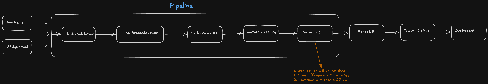

# Mini TollMatch

## What is currently implemented

- Reads GPS data from `data/Fleet_A_gps.parquet`
- Reads invoice data from `data/FleetA_invoices.csv`
- Converts rows into typed Pydantic models
- Clears and reloads raw MongoDB collections in batches

The current pipeline writes to these MongoDB collections:

- `gps_raw`
- `invoice_raw`

## Code navigation

```text
.
├── data/
│   ├── Fleet_A_gps.parquet        # Source GPS data
│   └── FleetA_invoices.csv        # Source toll invoice data
├── pipeline/
│   ├── main.py                    # Pipeline entrypoint
│   ├── config/
│   │   ├── config.py              # File paths and environment variables
│   │   └── constants.py           # MongoDB collection names
│   ├── readers/
│   │   ├── gps_reader.py          # Reads GPS parquet into GPSRecord models
│   │   └── invoice_reader.py      # Reads invoice CSV into InvoiceRecord models
│   ├── models/
│   │   ├── gps.py                 # GPS Pydantic schema
│   │   ├── invoice.py             # Invoice Pydantic schema
│   │   └── *.py                   # Additional planned domain models
│   └── database/
│       ├── mongo.py               # MongoDB client wrapper
│       ├── save.py                # Batch save helper
├── requirements.txt               # Python dependencies
└── .env                           # Local environment config, not committed
```

### Main flow

The pipeline starts in `pipeline/main.py`.

It does the following:

1. Connects to MongoDB.
2. Gets the `gps_raw` and `invoice_raw` collections.
3. Reads GPS records from the parquet file.
4. Saves GPS records to MongoDB in batches.
5. Reads invoice records from the CSV file.
6. Saves invoice records to MongoDB in batches.

The save helper in `pipeline/database/save.py` first clears the target
collection, then inserts records in chunks of `5000` documents. This is useful
because the GPS file contains millions of rows.

## Run locally

### 1. Create and activate a virtual environment

```bash
python3 -m venv .venv
source .venv/bin/activate
```

### 2. Install dependencies

```bash
pip install -r requirements.txt
```

### 3. Configure MongoDB

Create a `.env` file in the project root:

```env
MONGO_URI=your_mongodb_connection_string
DATABASE_NAME=tollmatch
```

### 4. Run the pipeline

From the project root:

```bash
python3 pipeline/main.py
```

Expected output starts like this:

```text
Connecting to MongoDB...
Connected to MongoDB
Database: tollmatch
Collections: gps_raw, invoice_raw
Reading GPS...
Loaded 3617050 GPS records
Cleared 0 existing documents from gps_raw
Inserted 5000/3617050 documents into gps_raw
Inserted 10000/3617050 documents into gps_raw
```

The GPS load is large, so the first full run can take a while. Collections will
appear in MongoDB after documents are inserted.

## HLD


